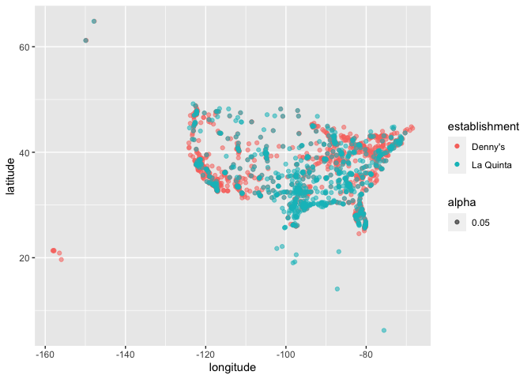
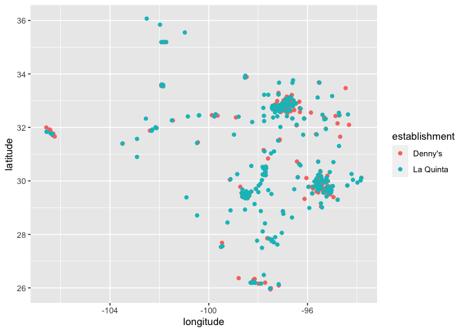
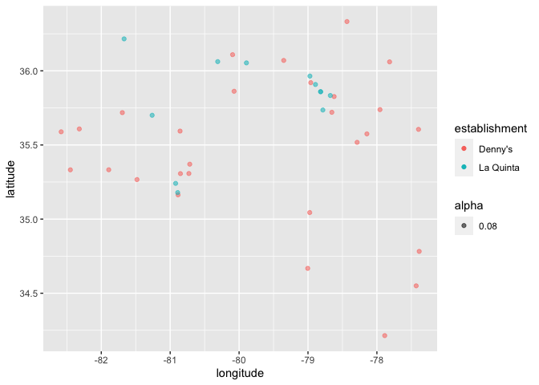

Lab 04 - La Quinta is Spanish for next to Denny’s, Pt. 1
================
Steph Bossert
20 Feb 21

### Load packages and data

``` r
library(tidyverse) 
load("/Users/stephaniebossert/Downloads/dennys.rda")
load("/Users/stephaniebossert/Downloads/laquinta.rda")
```

``` r
states <- read_csv("data/states.csv")
```

### Exercise 1

nrow(dennys) \#\#\#1643 ncol(dennys) \#\#\#6

### Exercise 2

nrow(laquinta) \#909 nrow(laquinta) 909 dennys: no la quinta: yes:
colombia, turkey, new zealand, chile, mexico, canada, honduras

### Exercise 3

dennys: no la quinta: yes: colombia, turkey, new zealand, chile, mexico,
canada, honduras …

### Exercise 4

The La Quinta doesn’t have country listed, so you could view using the
table function all of the states, then view the ones that aren’t US
states. You could also filter this out, but that would take a lot
longer, putting in 50 codes. \#\#\# Exercise 5

``` r
dennys %>% 
  filter(!(state %in% states$abbreviation))
```

    ## # A tibble: 0 x 6
    ## # … with 6 variables: address <chr>, city <chr>, state <chr>, zip <chr>,
    ## #   longitude <dbl>, latitude <dbl>

### Exercise 6

``` r
dennys %>%
  mutate(country = "United States")
```

    ## # A tibble: 1,643 x 7
    ##    address                city         state zip   longitude latitude country   
    ##    <chr>                  <chr>        <chr> <chr>     <dbl>    <dbl> <chr>     
    ##  1 2900 Denali            Anchorage    AK    99503    -150.      61.2 United St…
    ##  2 3850 Debarr Road       Anchorage    AK    99508    -150.      61.2 United St…
    ##  3 1929 Airport Way       Fairbanks    AK    99701    -148.      64.8 United St…
    ##  4 230 Connector Dr       Auburn       AL    36849     -85.5     32.6 United St…
    ##  5 224 Daniel Payne Driv… Birmingham   AL    35207     -86.8     33.6 United St…
    ##  6 900 16th St S, Common… Birmingham   AL    35294     -86.8     33.5 United St…
    ##  7 5931 Alabama Highway,… Cullman      AL    35056     -86.9     34.2 United St…
    ##  8 2190 Ross Clark Circle Dothan       AL    36301     -85.4     31.2 United St…
    ##  9 900 Tyson Rd           Hope Hull (… AL    36043     -86.4     32.2 United St…
    ## 10 4874 University Drive  Huntsville   AL    35816     -86.7     34.7 United St…
    ## # … with 1,633 more rows

### Exercise 7

Canada Colombia, Hondoras, Mexico

\#\#\#Exercise 8

``` r8
laquinta %>%
  mutate(country = case_when(
    state %in% state.abb     ~ "United States",
    state %in% c("ON", "BC") ~ "Canada",
    state == "ANT"           ~ "Colombia",
    state == "FM"            ~ "Hondoras",
    state == "AG"           ~  "Mexico"))     
  
```

### Exercise 9

``` r
table(dennys$state)
```

    ## 
    ##  AK  AL  AR  AZ  CA  CO  CT  DC  DE  FL  GA  HI  IA  ID  IL  IN  KS  KY  LA  MA 
    ##   3   7   9  83 403  29  12   2   1 140  22   6   3  11  56  37   8  16   4   8 
    ##  MD  ME  MI  MN  MO  MS  MT  NC  ND  NE  NH  NJ  NM  NV  NY  OH  OK  OR  PA  RI 
    ##  26   7  22  15  42   5   4  28   4   5   3  10  28  35  56  44  15  24  40   5 
    ##  SC  SD  TN  TX  UT  VA  VT  WA  WI  WV  WY 
    ##  17   3   7 200  27  28   2  49  25   3   4

``` r
###CA has the most and Deleware has the least
table(laquinta$state)
```

    ## 
    ##  AG  AK  AL ANT  AR  AZ  BC  CA  CH  CO  CT  FL  FM  GA  IA  ID  IL  IN  KS  KY 
    ##   1   2  16   1  13  18   1  56   1  27   6  74   1  41   4  10  17  17   9  10 
    ##  LA  MA  MD  ME  MI  MN  MO  MS  MT  NC  ND  NE  NH  NJ  NL  NM  NV  NY  OH  OK 
    ##  28   6  13   1   4   7  12  12   9  12   5   5   2   5   3  19   8  19  17  29 
    ##  ON  OR  PA  PU  QR  RI  SC  SD  SL  TN  TX  UT  VA  VE  VT  WA  WI  WV  WY 
    ##   1  10  10   2   1   2   8   2   1  30 237  12  14   1   2  16  13   3   3

``` r
###Texas has the most and Maine and Vermont have the least
```

\#\#\#\#Exercise 10

``` r
dennys %>%
  count(state) %>%
  inner_join(states, by = c("state" = "abbreviation")) %>%
  mutate(dennys_per_sqmile = 1000*n/area) %>%
 arrange(dennys_per_sqmile)
```

    ## # A tibble: 51 x 5
    ##    state     n name            area dennys_per_sqmile
    ##    <chr> <int> <chr>          <dbl>             <dbl>
    ##  1 AK        3 Alaska       665384.           0.00451
    ##  2 MT        4 Montana      147040.           0.0272 
    ##  3 SD        3 South Dakota  77116.           0.0389 
    ##  4 WY        4 Wyoming       97813.           0.0409 
    ##  5 IA        3 Iowa          56273.           0.0533 
    ##  6 ND        4 North Dakota  70698.           0.0566 
    ##  7 NE        5 Nebraska      77348.           0.0646 
    ##  8 LA        4 Louisiana     52378.           0.0764 
    ##  9 KS        8 Kansas        82278.           0.0972 
    ## 10 MS        5 Mississippi   48432.           0.103  
    ## # … with 41 more rows

``` r
###least alaska, most-DC
laquinta%>%
  count(state) %>%
  inner_join(states, by = c("state" = "abbreviation")) %>%
  mutate(laquinta_per_sqmile = 1000*n/area) %>%
  arrange(laquinta_per_sqmile)
```

    ## # A tibble: 48 x 5
    ##    state     n name            area laquinta_per_sqmile
    ##    <chr> <int> <chr>          <dbl>               <dbl>
    ##  1 AK        2 Alaska       665384.             0.00301
    ##  2 SD        2 South Dakota  77116.             0.0259 
    ##  3 ME        1 Maine         35380.             0.0283 
    ##  4 WY        3 Wyoming       97813.             0.0307 
    ##  5 MI        4 Michigan      96714.             0.0414 
    ##  6 MT        9 Montana      147040.             0.0612 
    ##  7 NE        5 Nebraska      77348.             0.0646 
    ##  8 ND        5 North Dakota  70698.             0.0707 
    ##  9 IA        4 Iowa          56273.             0.0711 
    ## 10 NV        8 Nevada       110572.             0.0724 
    ## # … with 38 more rows

\#\#\#least- Alaska, most- Rhode Island

\#\#\#\#Exercise 10

``` r
dennys <- dennys %>%
  mutate(establishment = "Denny's")
laquinta <- laquinta %>%
  mutate(establishment = "La Quinta")
dennys_laquinta <- bind_rows(dennys, laquinta)
ggplot(dennys_laquinta, mapping = aes(x = longitude, y = latitude, color = establishment, alpha = .05)) +
  geom_point()
```

<!-- -->

``` r
view(dennys_laquinta)
```

\#\#\#Exercise 12

``` r
dennys_laquintaTX <- dennys_laquinta %>%
  filter(state == "TX")
ggplot(dennys_laquintaTX, mapping = aes(x = longitude, y = latitude, color = establishment)) +
  geom_point()
```

<!-- -->
\#\#\#Exercise 11

``` r
dn_lqNC <- dennys_laquinta %>%
  filter(state == "NC")
ggplot(dn_lqNC, mapping = aes(x = longitude, y = latitude, color = establishment, alpha = .08)) +
  geom_point()
```

<!-- -->

\`\`\`
